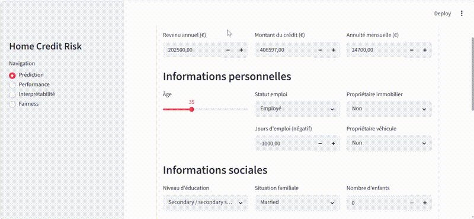

# Home Credit Risk

End-to-end ML project for credit default risk prediction, based on the [Home Credit Default Risk](https://www.kaggle.com/c/home-credit-default-risk) dataset from Kaggle.

## Objective

Predict the probability that a loan applicant will default, in order to improve loan approval decisions.

## Architecture

```
Raw CSV (Kaggle) -> dbt (Staging -> Intermediate -> Mart) -> DuckDB
                                                                |
                                              prepare_data.py (train/val/test split)
                                                                |
                                                 train_*.py (LightGBM, CatBoost)
                                                                |
                                            evaluate.py (metrics, SHAP, fairness)
                                                                |
                                                    FastAPI /predict
                                                                |
                                                  Streamlit dashboard
```

## Project structure

```
home-credit-risk/
├── home_credit/              # dbt project
│   ├── models/
│   │   ├── staging/          # 7 cleaning models
│   │   ├── intermediate/     # 9 feature engineering models
│   │   └── mart/             # final table (100+ features)
│   ├── dbt_project.yml
│   └── profiles.yml
├── src/                      # Python scripts
│   ├── prepare_data.py       # train/val/test split
│   ├── train.py              # LightGBM
│   ├── train_stacking.py     # LightGBM + CatBoost ensemble
│   ├── model_utils.py        # shared utilities (get_proba, etc.)
│   ├── evaluate.py           # orchestrates threshold, metrics, explain, fairness
│   ├── threshold.py          # decision threshold optimization
│   ├── metrics.py            # evaluation (AUC, confusion matrix)
│   ├── explain.py            # SHAP feature importance
│   └── fairness.py           # gender bias audit (Fairlearn)
├── api/
│   └── main.py               # FastAPI prediction endpoint
├── streamlit/
│   └── app.py                # interactive dashboard
├── data/
│   ├── raw/                  # source CSV from Kaggle
│   ├── processed/            # train/val/test parquet files
│   ├── dbt_output/           # DuckDB databases
│   └── references/           # metrics, SHAP, fairness artifacts (JSON, CSV, PNG)
├── models/                   # trained models (.joblib)
├── notebooks/                # EDA and exploration
└── mlruns/                   # MLflow tracking
```

## Tech stack

| Component | Technology |
|-----------|-----------|
| Data pipeline | dbt + DuckDB |
| ML | scikit-learn, LightGBM, CatBoost |
| Experiment tracking | MLflow |
| API | FastAPI |
| Frontend | Streamlit |
| Interpretability | SHAP |
| Fairness | Fairlearn |

## Installation

```bash
# Clone the repo
git clone https://github.com/your-username/home-credit-risk.git
cd home-credit-risk

# Create virtual environment
python -m venv .venv
source .venv/bin/activate  # Linux/Mac
# or .venv\Scripts\activate  # Windows

# Install dependencies
pip install -r requirements.txt
```

## Data

Download the data from [Kaggle](https://www.kaggle.com/c/home-credit-default-risk/data) and place it in `data/raw/`:

- `application_train.csv`: loan applications (target variable: TARGET)
- `bureau.csv`: credit bureau history
- `bureau_balance.csv`: monthly bureau balances
- `previous_application.csv`: previous applications
- `credit_card_balance.csv`: credit card balances
- `installments_payments.csv`: payment history
- `POS_CASH_balance.csv`: POS/cash balances

## dbt pipeline

```bash
cd home_credit

# Run the full pipeline
dbt run

# Or run by layer
dbt run --select staging.*
dbt run --select intermediate.*
dbt run --select mart.*

# Tests
dbt test
```

### dbt layers

1. **Staging** (7 models): cleaning, column renaming
2. **Intermediate** (9 models): feature engineering
   - Financial ratios (income/credit, annuity/income)
   - Bureau aggregations (credit count, debt, overdue payments)
   - Payment behavior (late payment rate, ratios)
   - External scores and interactions
3. **Mart** (1 table): final join with 100+ features

Reproducibility note: the `ORDER BY loan_id` clause in the mart model is non negotiable. It guarantees that the train/val/test split stays identical across pipeline runs.

## Training

```bash
# Prepare the data (train/val/test split)
python src/prepare_data.py

# Train the baseline model (LightGBM)
python src/train.py

# Train the stacking ensemble (LightGBM + CatBoost)
python src/train_stacking.py

# Evaluate the model (orchestrates threshold, metrics, SHAP, fairness)
python src/evaluate.py stacking_model
```

`evaluate.py` automatically chains `threshold.py`, then `metrics.py`, then `explain.py`, then `fairness.py`, and saves all artifacts to `data/references/` (metrics JSON, SHAP CSV, images).

### Available models

| Model | Description | File |
|-------|-------------|------|
| Baseline LR | Logistic regression | `models/baseline_lr.joblib` |
| LightGBM | Tuned GBDT | `models/lgbm_baseline.joblib` |
| CatBoost | Native categorical handling | `models/catboost_baseline.joblib` |
| Stacking | LightGBM + CatBoost + LR meta model | `models/stacking_model.joblib` |

## Results (stacking_model, test set)

| Metric | Value |
|--------|-------|
| AUC | 0.7794 |
| Decision threshold | 0.09 |
| Recall (TPR) | 42.3% of defaults detected |
| FPR | 9.8% of good clients rejected |
| FNR | 57.7% of defaults missed |
| Accuracy | 86.3% |

### Fairness (gender audit)

| Gender | AUC | Selection rate | FPR | FNR |
|--------|-----|----------------|-----|-----|
| F | 0.7723 | 10.4% | 8.4% | 62.5% |
| M | 0.7812 | 16.4% | 12.7% | 51.2% |

`gender_clean` is never used as a model feature, only as the sensitive attribute for the Fairlearn audit.

## API

```bash
# Run the API
cd api
uvicorn main:app --reload
```

### Endpoints

- `GET /health`: loaded model status and active decision threshold
- `POST /predict`: default prediction. Most fields are optional; the API recomputes missing ratios (`ext_source_mean`, `ratio_income_credit`, `credit_to_annuity_ratio`, etc.) from the fields provided.

```bash
# Example request (minimal fields)
curl -X POST http://127.0.0.1:8000/predict \
  -H "Content-Type: application/json" \
  -d '{
    "income_amount": 202500,
    "credit_amount": 406597,
    "annuity_amount": 24700,
    "age_years": 35,
    "ext_source_2": 0.6,
    "ext_source_3": 0.5
  }'
```

### Response

```json
{
  "default_probability": 0.1234,
  "threshold": 0.09,
  "decision": 0,
  "risk_level": "low"
}
```

## Streamlit dashboard

```bash
cd streamlit
streamlit run app.py
```

<!-- TODO: replace with final demo gif -->


### Pages

1. **Prediction**: interactive form to submit an application (calls the FastAPI endpoint)
2. **Performance**: model metrics (AUC, recall, confusion matrix), read from `data/references/`
3. **Interpretability**: SHAP feature importance (top 15 features)
4. **Fairness**: gender bias audit

## Feature engineering

### Main features

| Category | Examples |
|----------|----------|
| Financial ratios | `ratio_income_credit`, `ratio_annuity_income`, `credit_to_goods_ratio` |
| Demographics | `age_group`, `is_employed`, `years_employed` |
| External scores | `ext_source_1`, `ext_source_2`, `ext_source_3`, interactions |
| Bureau | `bureau_credit_count`, `bureau_debt_total`, `bureau_overdue_max` |
| Payments | `inst_late_ratio`, `cc_utilization_avg`, `pos_dpd_max` |
| Social circle | `def_30_social_ratio`, `def_60_social_ratio` |

## Evaluation

- **Primary metric**: ROC-AUC
- **Decision threshold**: optimized on Best F1 (see `threshold.py`)
- **Fairness**: false positive/negative rate audit by gender via Fairlearn

## MLflow

```bash
# Launch the MLflow UI
mlflow ui
```

Access: http://127.0.0.1:5000

## Main dependencies

See `requirements.txt` for the complete list with pinned versions.

```
dbt-core
dbt-duckdb
pandas
numpy
scikit-learn
lightgbm
catboost
shap
fairlearn
mlflow
fastapi
uvicorn
streamlit
```

## Author

Fama Diallo

## License

MIT
